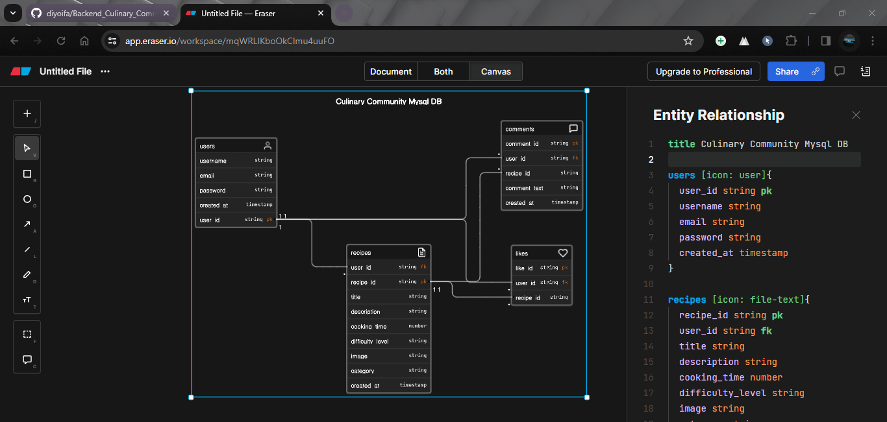

# RecipeHub: Culinary Community & Recipe Management Platform

## Description

RecipeHub is a dynamic web application aimed at bringing together food enthusiasts, offering a seamless platform to explore, share, and manage culinary creations. Users can discover an extensive array of recipes contributed by the community, easily filter them based on categories, and engage with others by sharing their own recipes.

This platform empowers users to create, modify, and delete their recipes, fostering a collaborative environment for culinary exploration. With a robust backend built on FastAPI, RecipeHub ensures efficient data management and seamless user interactions, providing a delightful experience for passionate cooks and food aficionados alike.

## Functional Requirements:

### User Authentication and Authorization:
- **Users should be able to** register, log in, and log out.
- **Authentication mechanisms** should ensure secure access to personal profiles and recipe management.

### Recipe Management:

- **Users can:** create, view, edit, and delete their recipes.
- **Recipes should include:** fields for title, ingredients, instructions, cooking time, difficulty level, category, and optional images.

### Search and Filtering:

- **A search functionality** allowing users to search for recipes based on keywords, ingredients, or tags.
- **Filtering and sorting options:** for recipes by categories (e.g., cuisine type, dietary preferences, meal type).

### Social Interaction:

- **Users can** view a feed of recipes and to share also Ability to like and comment on

### User Profile:

- **Profiles for each user** displaying their created recipes

## Non- Functional Requirements:

### Performance:

- **Fast response times** for loading recipes and performing actions on the platform.
- **Scalability** to handle a growing user base and recipe database.

### Security:

- **Secure authentication and authorization** mechanisms to protect user data.
- **Encryption of sensitive information** like user credentials and personal details.
- **Prevention of common web vulnerabilities** (SQL injection, XSS, CSRF, etc.).

### Usability and User Experience:

- **Intuitive and user- friendly interface** for easy navigation and interaction.
- **Consistent design and responsiveness** across various devices and screen sizes.

### Reliability:

- **High availability and minimal downtime** for users accessing the platform.

### Data Integrity:

- **Data validation** to ensure the integrity of information entered by users.

### Scalability:

- **Ability to accommodate an increasing number** of users, recipes, and interactions without compromising performance.

# Technology Stack:

- **Utilizing FastAPI for the backend**, following the Model- View- Controller (MVC) architectural pattern and applying SOLID principles to ensure a robust and maintainable codebase. as well as Mysql for the data manipulation

- **For the frontend development, Angular will be employed**, leveraging its component composition approach and standalone modules architecture

- **Optimize the technology stack** for efficiency, scalability, and maintainability.

# MySQL DATABASE DESIGN
